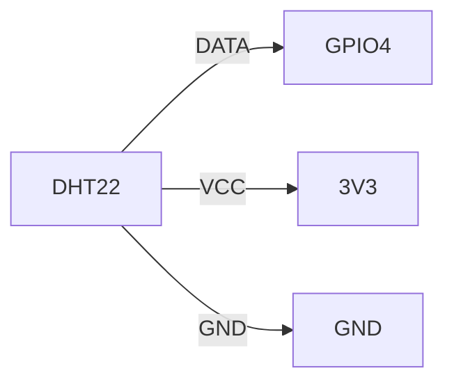

# DHT22 Wiring Diagram

## Quick Start
```
DHT22 DATA → Raspberry Pi GPIO4 (Pin 7)
DHT22 VCC → 3.3V (Pin 1)
DHT22 GND → GND (Pin 6)
```

## Visual Guide

### Raspberry Pi Pinout
```
  3V3 (1)  (2) 5V
  GPIO2 (3)  (4) 5V
  GPIO3 (5)  (6) GND
  GPIO4 (7)  (8) GPIO14
  GND (9)  (10) GPIO15
```

### Steps
1. Connect **DHT22 DATA** to **GPIO4 (Pin 7)**.
2. Connect **DHT22 VCC** to **3.3V (Pin 1)**.
3. Connect **DHT22 GND** to **GND (Pin 6)**.

### Diagram


## Advanced
- **Pull-Up Resistor**: Add a 4.7kΩ resistor between DATA and VCC for stability.
- **Fast Mode**: Use `DHT22(fast_mode=True)` for 1Hz updates.
