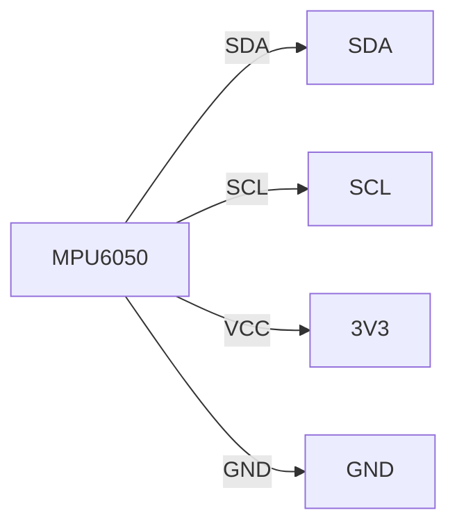

# MPU6050 Wiring Diagram

## Quick Start
```
MPU6050 SDA → Raspberry Pi SDA (Pin 3)
MPU6050 SCL → Raspberry Pi SCL (Pin 5)
MPU6050 VCC → 3.3V (Pin 1)
MPU6050 GND → GND (Pin 6)
```

## Visual Guide

### Raspberry Pi Pinout
```
  3V3 (1)  (2) 5V
  GPIO2 (3)  (4) 5V
  GPIO3 (5)  (6) GND
  GPIO4 (7)  (8) GPIO14
  GND (9)  (10) GPIO15
```

### Steps
1. Connect **MPU6050 SDA** to **SDA (Pin 3)**.
2. Connect **MPU6050 SCL** to **SCL (Pin 5)**.
3. Connect **MPU6050 VCC** to **3.3V (Pin 1)**.
4. Connect **MPU6050 GND** to **GND (Pin 6)**.

### Diagram


## Advanced
- **Custom Address**: Use `MPU6050(address=0x69)`.
- **Custom Bus**: Use `MPU6050(bus=0)`.
- **Interrupt Pin**: Connect INT to GPIO for motion detection.
